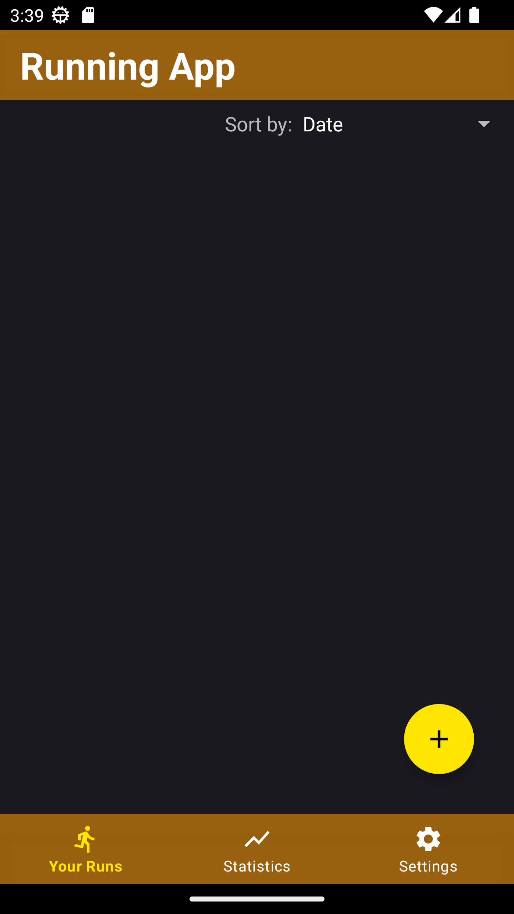
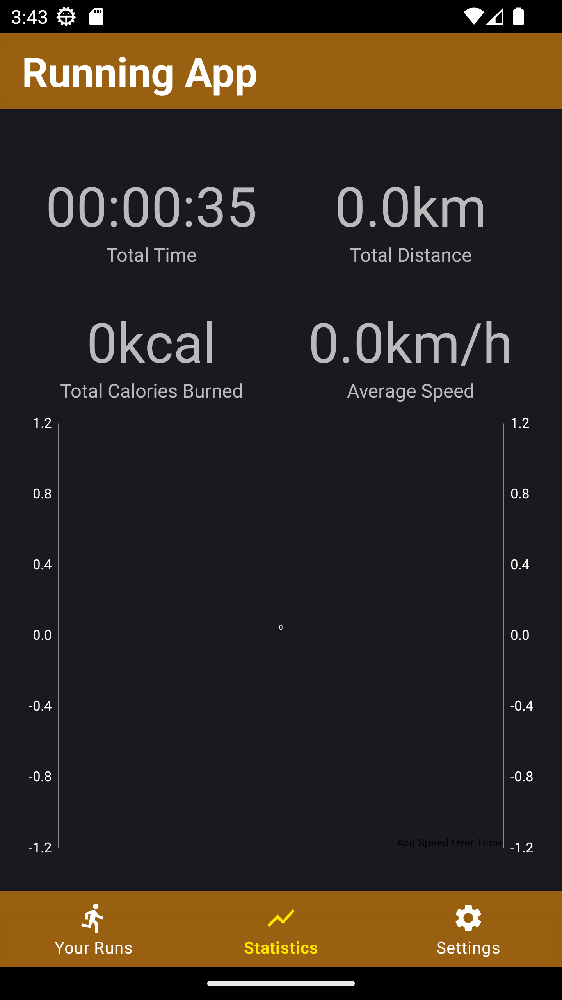
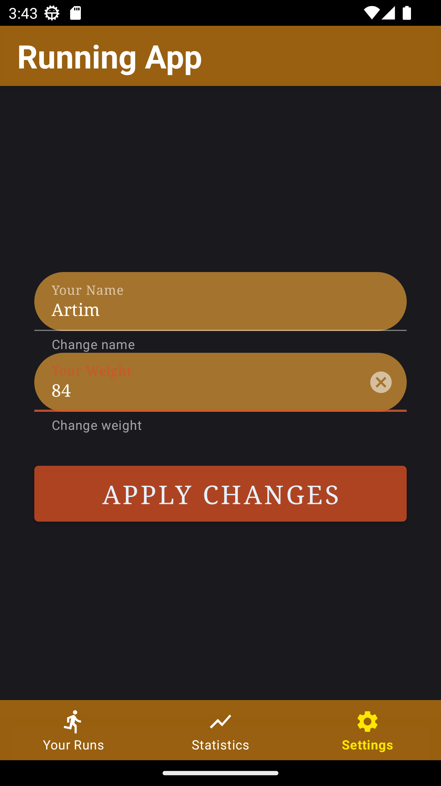
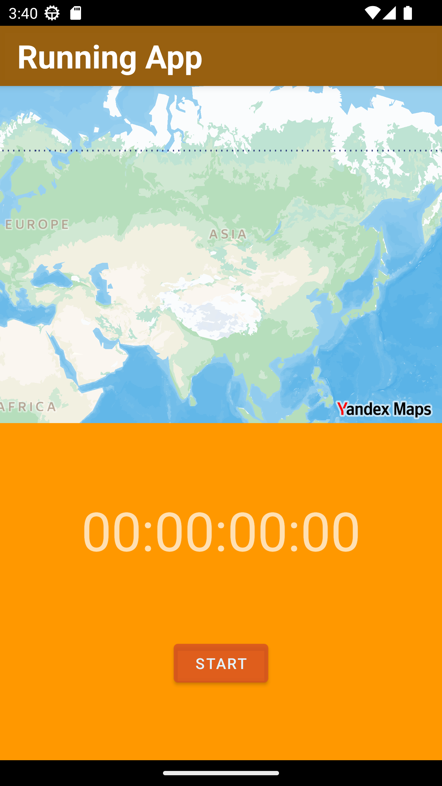
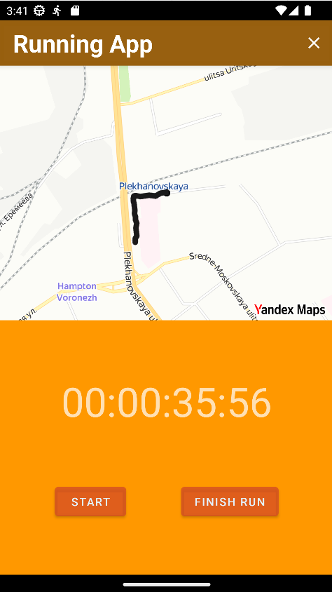
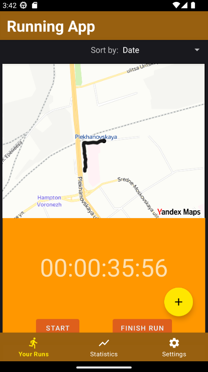

# MapKitRunProject

Developed for my own use. 
Designed for tracking and displaying running track, saving data about jogging (track, speed, distance), keeping statistics.

# Features
- MVVM architecture pattern
- Clean Architecture
- Storing runs using Room database
- Uses MPAndroidChart to keep statistics.
- Uses MapKit to display and work with the track.

# Gallery

<li>
  No runs
</li>
<li>
  
</li>
<li>
  Statistics screen
</li>
<li>
  
</li>
<li>
 Settings screen
</li>
<li>
  
</li>
<li>
  Starting tracking
</li>
<li>
  
</li>
<li>
  Finishing tracking
</li>
<li>
  
</li>
<li>
  Created
</li>
<li>
  
</li>

